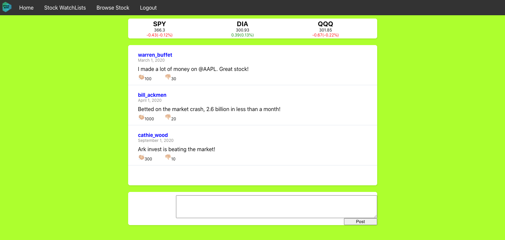
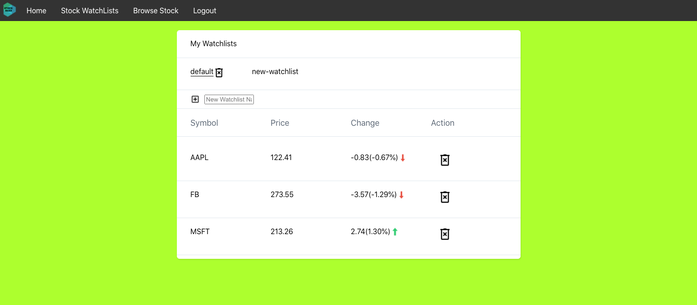
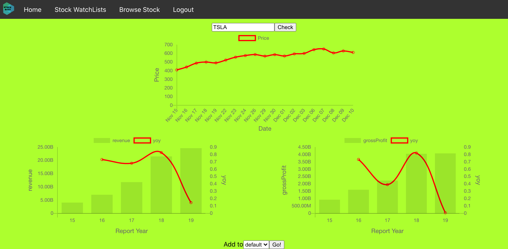

##What is stock buzz?
Stock buzz allows users to keep track of stock trends as well as communicate with fellow stock lovers.

##Major Functionalities
1. Make posts about your opinions on the stock market. You can also check the posts from others and like/dislike any one of them.

2. Manage watchlists of stocks that you are interested in and keep updated about their price changes. Users can add/delete watchlists and check the price movements for the stocks in a specific watchlist.

3. Check the prices and fundamental infos about a particular stock. It can be added to (see the bottom choice of the picture below) an existing watchlist if the user wants.

##Acknowlegement
The logo is designed using https://www.freelogodesign.org/.
Other icons used are from https://icons8.com/.
Two external API services are used to get stock price data and fundamentals data.
https://finnhub.io
https://financialmodelingprep.com
